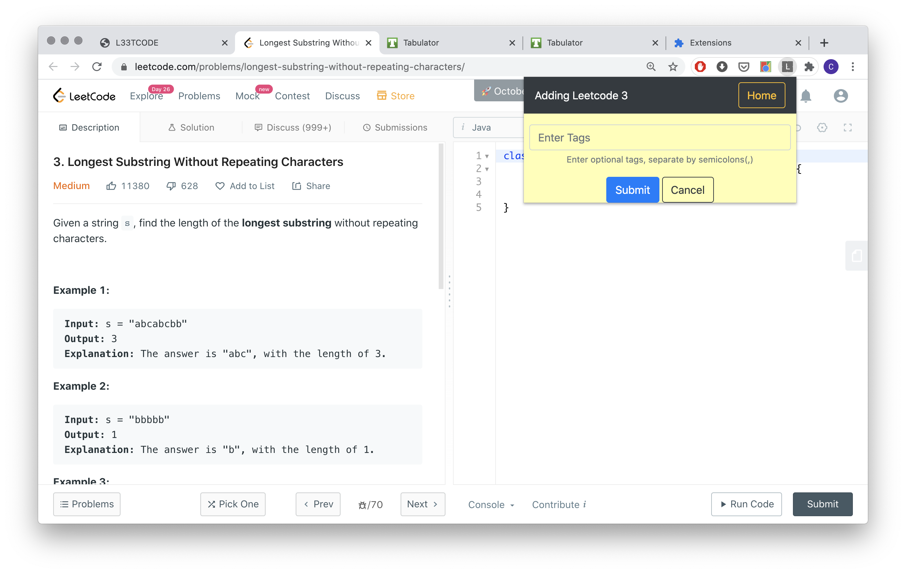
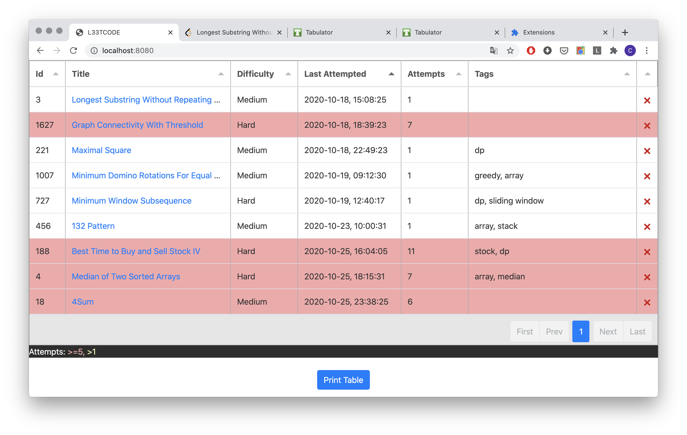

# leetcode

leetcode刷题助手，

所有服务都在本地跑，所以需要配置。

mac安装mongodb看这里 -> https://github.com/mongodb/homebrew-brew

main文件夹启动本地服务(localhost:8080) -> go build; ./main

chrome-extension添加chrome插件, 安装方法看这里 -> https://developer.chrome.com/extensions/getstarted

P.S.
发布chrome插件竟然要5刀注册费和插件图标，懒得发布了。

插件截图

主页截图

